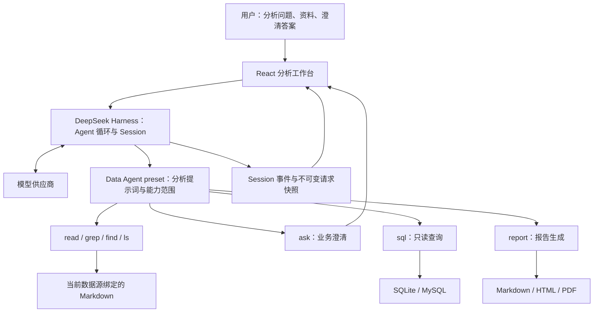

# MD Data Agent

基于 DeepSeek Harness 和 Cordis 的智能数据分析助手。用户用自然语言提出问题，Agent 阅读当前数据库的结构与业务资料，澄清指标口径，执行 SQL，再给出结论或生成报告。工作台保留每轮实际请求、工具调用和执行结果，方便检查结论是怎样得到的。

## 项目思路

数据分析需要同时理解“表里有什么”和“业务上怎么算”。表名、字段名只能说明结构；收入、退款率、活跃用户等指标，还依赖统计对象、时间范围、状态和单位的定义。本项目将这些知识放在可维护的 Markdown 中，让 Agent 在查询前阅读资料，缺少会影响结果的定义时先向用户提问。

设计围绕四件事展开：

- **知识显式化**：Schema 与业务说明统一使用 Markdown，按数据库绑定和管理。
- **工具保持精简**：文件阅读、检索、澄清、SQL、报告分别承担明确职责，普通分析只开放七个工具。
- **计算交给数据库**：聚合、关联和统计通过 SQL 完成，查询结果区分预览与完整数据。
- **过程可检查**：提示词、模型请求、工具参数、执行结果和状态变化都能在 Trace 中查看。

## 整体架构



**DeepSeek Harness** 提供已有的 Agent 循环、模型接入、工具调度、会话持久化和用户交互能力。**Cordis** 负责插件组合、服务注入、作用域和生命周期。Data Agent 通过插件与 preset 增加分析能力，Web 与 SDK 使用同一套分析预设。

实现主要分为三个部分：

| 部分 | 位置 | 职责 |
| --- | --- | --- |
| 分析工作台 | `apps/dataagent-ui` | 对话、数据源与文档管理、查询结果、报告和执行树 |
| 分析插件 | `packages/experimental/data-agent` | 提示词、工具、数据源范围、知识版本、SQL Worker、报告与请求记录 |
| 启动配置 | `dsh-data-agent.patch.yml` 与 `scripts/prepare-data-agent-profile.ts` | 创建专用 profile，选择分析预设，初始化默认模型并保留后续设置 |

分析预设在自己的作用域内注册工具和指引；同一 Harness 中的其他预设不会收到数据分析提示词和领域工具。普通分析默认使用一个 Agent，子 Agent 与 workflow 编排通过配置按需启用。

## 设计与实现

### 1. Schema 与业务知识统一读 Markdown

Schema 文档描述表、字段、关联和单位；业务文档描述指标定义、状态含义、统计范围与特殊规则。两类文档使用相同的上传、阅读、启停、替换和版本管理方式，Agent 使用同一个 `read` 工具读取。

文档绑定到具体数据源。每轮请求根据当前分析选择的数据库，列出该库已启用的资料路径；提示词要求先阅读这些结构与业务资料，再开始分析。资料内容通过真实工具调用进入上下文，阅读过程也会留下记录。

人工表浏览器可以刷新实时数据库元数据。它和 Markdown 知识库分别管理；未提供结构文档时，系统保留这个状态，不自动生成 Schema Markdown。

### 2. Context Engineering 与 LLM Wiki 思路

本项目的 **Context Engineering** 体现在每次请求如何组织上下文：分析角色与规则保持简短；数据库范围和资料路径随当前会话选择；文档全文由工具读取；查询只保留有限预览，完整结果按路径继续阅读。这样，模型能找到当前问题需要的知识，也能区分不同数据库的业务定义。

知识发布时使用内容摘要生成不可变目录版本，历史请求保留当时使用的资料路径。文档更新在后续请求中生效，使历史过程仍可核查。

**LLM Wiki** 的借鉴点是把知识放在可阅读、可维护的外部文档中：将字段含义、指标口径和业务经验整理为 Markdown，按主题和数据库持续维护，让模型分析时读取这些知识。当前实现提供文档管理和按库阅读；自动编写 Wiki、构建知识图谱或自动沉淀新知识仍未实现。

### 3. 七个工具，各自完成一件事

| 工具 | 用途 |
| --- | --- |
| `read` | 阅读结构文档、业务文档和完整查询结果 |
| `grep` | 按内容检索资料 |
| `find` | 按文件名模式查找资料 |
| `ls` | 查看目录的直接子项 |
| `ask` | 向用户澄清口径和条件，并等待回答 |
| `sql` | 在选定数据库执行只读 SQL |
| `report` | 将完整 Markdown 生成可下载的报告 |

文件阅读、检索和提问复用 Harness 的现有实现。SQL 与报告由分析插件提供。分析预设限制可见工具，计算优先由 SQL 完成；通用文件修改和脚本执行工具不向普通分析开放。评测预设额外提供 `benchmark`，用于显式提交最终 SQL。

### 4. 提示词驱动业务澄清

用户问题和资料都未定义某个指标，且不同合理定义会改变结果时，提示词要求先调用 `ask` 并等待用户回答，再查询或计算该指标。已经明确的条件不重复询问。

例如“统计退款率”，可能按退款订单数、退款乘车人数或退款金额计算；“统计收入”也可能涉及支付状态、退款扣减和统计日期。Agent 应先阅读业务资料；资料仍不足以确定定义时，再请求用户确认。

澄清由真实的 `ask` 工具调用进入交互流程，答案作为工具结果写入 Session，后续请求能够使用已确认条件。这属于模型指引，SQL 执行器本身不判断业务口径，也不保证模型每次都按要求提问。

### 5. SQL 执行与完整结果

SQL 工具支持 SQLite 和 MySQL。SQLite 以只读方式打开并启用 `query_only`，MySQL 使用只读事务；执行器检查语句，拒绝多语句、可执行 SQL 注释和 SQL 文件写入。MySQL 部署还应使用只读数据库账号。

查询在独立 Worker 中执行，完整行流式写入结果文件，内存只保留有限预览。返回结果包含预览、总行数与完整文件路径，避免将前几行当作总体。查询失败删除不完整文件；取消时等待 Worker 退出。超时、结果行数和字节数上限可通过配置设置。

### 6. Trace 与报告

Trace 将持久化的 Session 事件组织成轮次、步骤、模型请求和工具调用。每次实际模型请求保存不可变快照，可查看提示词、上下文、工具定义、模型配置和原始请求信息；工具节点显示参数、结果、耗时和状态。记录范围是 Harness 请求与可见事件，供应商 HTTP 内部载荷和模型隐藏思考不在范围内。

前端从同一份事件日志恢复对话与执行树，并订阅后续事件。报告生成使用普通、可记录的 follow-up：用户选择格式后发起生成，`report` 接收完整 Markdown，输出 Markdown、HTML 或 PDF，历史修订保留。PDF 渲染需要可用的 Playwright Chromium 与字体。

## BIRD 与 Spider 测试

官方基准测试使用独立工程，数据、配置、运行器、工作目录和日志均与产品工程分开。测试直接读取官方原件：BIRD 的 `database_description` CSV，以及 Spider 的 `DDL.csv`、表级 JSON 和题目指定资料。不会把这些原件改写成生成的 Markdown，也不会混入产品的 Schema 或业务资料。

一次固定小样本测试使用 `glm-5.3-flash`，每个数据集各 10 题，按官方评分流程评估：

| 数据集 | 官方正确 | 正常完成并提交 | 超时 |
| --- | --- | --- | --- |
| BIRD Mini-Dev | 7/10 | 10/10 | 0/10 |
| Spider 2.0-Lite SQLite | 3/10 | 6/10 | 4/10 |

通过实际会话的逐行覆盖核验，20/20 题完整返回了提供的官方资料；文件副本字节校验通过，参考 SQL 和标准结果仅供 Agent 工作目录之外的官方评分器使用。读取完整、执行过中间 SQL、最终提交正确分别检查。以上结果仅属于这 20 道固定样本，不代表完整基准成绩；测试模型配置不会随产品默认配置发布。

<a id="run"></a>

<a id="run-from-source"></a>

## 本地运行

需要 Node.js `^22.19.0 || >=24.0.0` 和 pnpm `11.7.0`。Windows 下可运行 `start.bat`，它会安装依赖、构建缺少的产物、准备专用 profile 并启动工作台。也可手动执行：

```sh
pnpm install
pnpm run build
pnpm --filter dataagent-ui run build
pnpm exec tsx scripts/prepare-data-agent-profile.ts
pnpm dsh --profile data-agent
```

新用户仅获得官方 DeepSeek 模型配置，默认选择 DeepSeek Flash。通过“模型与 API”配置自己的密钥，或将 `.env.example` 复制为 `.env` 后填写 `DEEPSEEK_API_KEY`。准备脚本保留后续已选择的模型，也可通过界面接入其他供应商。

启动后连接自己的数据库，上传对应的 Schema 和业务 Markdown，再发起分析。仓库不预置个人数据库连接、业务资料或 API Key。

## 仓库与凭据管理

仓库保留运行所需的 Harness 工作区、Cordis 源码、构建脚本和回归测试。本地凭据、数据库、业务文档、构建产物、浏览器录制和基准测试运行记录由 `.gitignore` 排除。

提交前可运行 `pnpm run check:git-files`，提交钩子也会拒绝被强行加入暂存区的忽略文件。这项检查针对 Git 文件范围；源码中是否含有密钥仍需内容扫描。本项目沿用 DeepSeek Harness 的 MIT 许可证，上游包名保持不变，依赖许可证记录在仓库的许可证清单中。

## English abstract

MD Data Agent is a Markdown-driven database analysis assistant built on DeepSeek Harness and Cordis. It binds schema and business documents to data sources, exposes seven focused tools, asks users to clarify ambiguous metrics, executes read-only SQL, and records inspectable session traces. The Chinese sections above describe the architecture, implementation and local setup in full.
